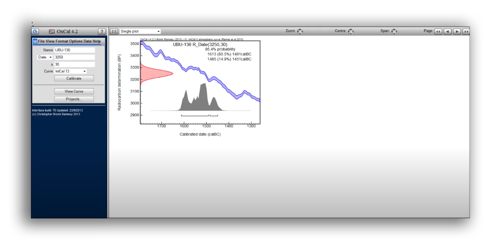

# RATIONALE #

* Checklist or mere deployment procedures to run Oxcal in a Microsoft Windows environment
* This repo is a living document that will grow and adapt over time

### What is this repository for? ###

* Quick summary
    - Download, unzip, deploy and run Oxcal
* Version 1.01

### How do I get set up? ###

* Summary of set up & configuration
    - Just check our [checklist](snippet.md)
* Dependencies
    - [Node.js](https://nodejs.org/) 
* Database configuration
    - There is no database to handle. 
* Deployment instructions
    - You can check our original [snippet](https://bitbucket.org/imhicihu/workspace/snippets/gA8XGp/oxcal-running-in-local-mode)

### Source ###

* Check them on [here](https://bitbucket.org/imhicihu/oxcal/src)

### Issues ###

* Check them on [here](https://bitbucket.org/imhicihu/oxcal/issues)

### Changelog ###

* Please check the [Commits](https://bitbucket.org/imhicihu/oxcal/commits/) section for the current status

### Contribution guidelines ###

* Code review
    - You can submit a PR to enhance this repo (found typos, minimize steps to reproduce, _et alia_)
* Other guidelines
    - There is no other guidelines
     
### Who do I talk to? ###

* Repo owner or admin
    - Contact `imhicihu` at `gmail` dot `com`
* Other community or team contact
    - ~~Contact is _enable_ on the [board](https://bitbucket.org/imhicihu/oscal/addon/trello/trello-board) of this repo. (You need a [Trello](https://trello.com/) account)~~

### Code of Conduct

* Please, check our [Code of Conduct](https://bitbucket.org/imhicihu/oxcal/src/master/code_of_conduct.md)

### Legal ###

* All trademarks are the property of their respective owners.

### License ###

* The content of this project itself is licensed under the 